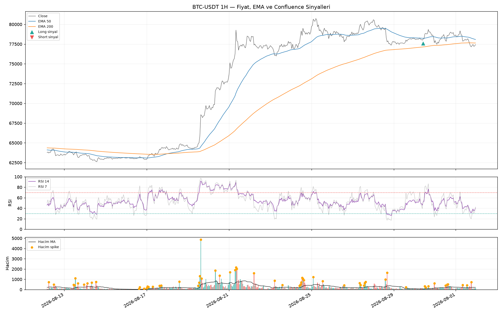
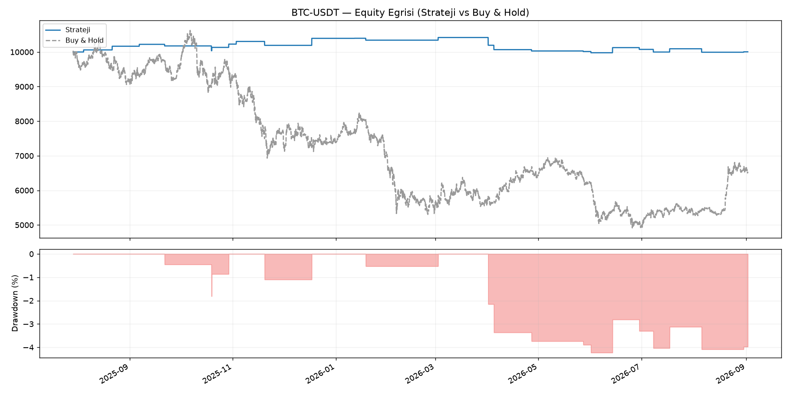

# neyedayanarak

OKX'ten çekilen geçmiş mum (OHLCV) verileri üzerinde **price action + RSI +
hacim** katmanlarını birleştiren (confluence) bir kripto alım-satım
stratejisini kurar, in-sample/out-of-sample ayrımıyla backtest eder ve
sonuçları görselleştirir.

> ⚠️ **Yatırım tavsiyesi değildir.** Bu repo yalnızca araştırma/eğitim
> amaçlıdır. Backtest sonuçları geçmiş veriye dayanır ve gelecekteki
> performansı garanti etmez. Bkz. [Bulgular ve riskler](#bulgular-ve-riskler).

## Canlı pano

**[klonnist.github.io/neyedayanarak](https://klonnist.github.io/neyedayanarak/)**

Bu adreste, aynı confluence stratejisinin **tamamen sanal (paper trading)**
bir hesapla canlı OKX verisi üzerinde nasıl çalıştığını gösteren bir pano
yayında: `BTC-USDT`/`ETH-USDT` × `1H`/`4H` için 4 ayrı, sıfırdan 10.000 USDT
sanal bakiyeyle başlayan profil; her biri kendi bakiyesini, açık pozisyonunu,
kazanma oranını, equity eğrisini ve son işlemlerini gösteriyor.

Pano, [.github/workflows/paper_trading.yml](.github/workflows/paper_trading.yml)
ile her 15 dakikada bir çalışan bir GitHub Actions job'ı tarafından güncelleniyor:
[live/run_paper_trading.py](live/run_paper_trading.py) güncel mumları çeker,
[live/paper_engine.py](live/paper_engine.py) yeni kapanan her mumu bir önceki
çalıştırmadan kalan durumun (`live/state/*.json`) üzerine işleyip pozisyon
açar/kapatır, sonuç [docs/data/status.json](docs/data/status.json) olarak
yazılıp GitHub Pages'e (statik `docs/` klasörü) commit'lenir.

> ⚠️ Gerçek para veya borsa hesabı **kesinlikle kullanılmıyor**; bu tamamen
> bir simülasyondur ve yatırım tavsiyesi değildir.

## Ne yapar?

1. **Veri çekme** ([src/data_fetcher.py](src/data_fetcher.py)) — OKX'in public
   `/api/v5/market/history-candles` endpoint'inden (API anahtarı gerekmez)
   sayfalama (pagination) ile istenen tarih aralığındaki tüm mumları çeker ve
   `data/` altına CSV olarak önbellekler.
2. **İndikatörler** ([src/indicators.py](src/indicators.py)) — EMA(50/200),
   Wilder RSI (7/14/21), ATR(14), OBV, rolling ve gün-bazlı (anchored) VWAP.
3. **Price action** ([src/strategy.py](src/strategy.py)) — engulfing, doji,
   hammer/shooting star, pin bar, inside bar tespiti; swing high/low bazlı
   destek/direnç; N-bar breakout; EMA50/EMA200 ile trend filtresi.
4. **RSI katmanı** — statik 30/70 eşik geçişleri + fiyat/RSI swing noktaları
   arasındaki regular divergence tespiti.
5. **Hacim katmanı** — hareketli ortalamaya göre hacim spike tespiti, OBV
   eğimi, VWAP'a göre konum.
6. **Confluence stratejisi** ([src/strategy.py](src/strategy.py)) — üç
   katmandan en az `min_confluence` tanesi aynı yönde oy verirse sinyal
   üretir. Giriş ATR bazlı stop-loss, ATR bazlı take-profit ve ATR trailing
   stop ile yönetilir.
7. **Backtest** ([src/backtest.py](src/backtest.py)) — bar-bar event-driven
   motor; veriyi kronolojik olarak %70 in-sample / %30 out-of-sample'a böler,
   in-sample üzerinde küçük bir grid-search ile parametre optimizasyonu
   yapar, seçilen parametrelerle out-of-sample'da doğrulama yapar. Price
   action / RSI / hacim katmanlarını tek başına ve birlikte kullanarak
   karşılaştırır, buy & hold ile kıyaslar.
8. **Görselleştirme** ([src/visualize.py](src/visualize.py)) — fiyat + EMA +
   sinyaller, RSI paneli, hacim paneli (spike'lar işaretli), equity curve ve
   drawdown grafiği.

## Kurulum

```bash
pip install -r requirements.txt
```

Python 3.10+ önerilir. Bağımlılıklar: `requests`, `pandas`, `numpy`,
`matplotlib`.

## Kullanım

```bash
python main.py --symbol BTC-USDT --timeframe 1H --start 2023-01-01 --end 2026-09-01 --optimize
```

Birden fazla sembolü karşılaştırmak için:

```bash
python main.py --symbols BTC-USDT,ETH-USDT --timeframe 4H --optimize
```

### Parametreler

| Parametre | Açıklama | Varsayılan |
|---|---|---|
| `--symbol` / `--symbols` | OKX sembolü ya da virgüllü liste | `BTC-USDT` |
| `--timeframe` | `1m,3m,5m,15m,30m,1H,2H,4H,6H,12H,1D,1W` | `1H` |
| `--start`, `--end` | Tarih aralığı (UTC, `YYYY-MM-DD`) | `2023-01-01` / `2026-09-01` |
| `--optimize` | In-sample veride grid-search parametre optimizasyonu yapar | kapalı |
| `--min-confluence` | Optimize kapalıyken kullanılacak minimum katman sayısı (1-3) | `2` |
| `--atr-stop-mult`, `--atr-target-mult` | Optimize kapalıyken ATR stop/hedef çarpanları | `2.0` / `3.0` |
| `--train-frac` | In-sample oranı | `0.7` |
| `--long-only` | Short sinyalleri devre dışı bırakır | kapalı (short açık) |
| `--force-refresh` | CSV önbelleğini yok sayıp OKX'ten yeniden çeker | kapalı |
| `--outdir`, `--data-dir` | Çıktı / ham veri klasörleri | `outputs` / `data` |

Her çalıştırma `outputs/<SEMBOL>/` altına şunları üretir: `report.json`
(tüm metrikler + kullanılan parametreler), `price_signals.png`,
`equity_drawdown.png`, `layer_comparison.csv` (katman bazlı karşılaştırma)
ve (`--optimize` ile) `param_grid_results.csv`.

## Örnek çıktı

`python main.py --symbols BTC-USDT,ETH-USDT --timeframe 1H --start 2023-01-01 --end 2026-09-01 --optimize`
çalıştırmasından elde edilen örnek sonuçlar [outputs/sample/](outputs/sample/)
altında commit'lenmiştir.



Üstte fiyat + EMA50/EMA200 + confluence sinyalleri, ortada RSI(14/7), altta
hacim ve spike'lar gösteriliyor.



Strateji equity eğrisi (mavi) out-of-sample dönemde piyasa sert düşerken
(gri kesikli çizgi, buy & hold) sermayeyi büyük ölçüde korumuş.

## Bulgular ve riskler

Aşağıdaki sayılar `2023-01-01 → 2026-09-01`, `1H` zaman diliminde, %70
in-sample / %30 out-of-sample ayrımıyla, in-sample üzerinde grid-search ile
optimize edilmiş parametrelerle elde edilmiştir (tam rapor:
[outputs/sample/BTC-USDT/report.json](outputs/sample/BTC-USDT/report.json),
[outputs/sample/ETH-USDT/report.json](outputs/sample/ETH-USDT/report.json)).
Out-of-sample dönem (~2025-07 → 2026-09), BTC-USDT'nin buy & hold ile
**-%34.7**, ETH-USDT'nin **-%36.8** kaybettiği belirgin bir ayı piyasasına
denk geldi.

| Sembol | Strateji (OOS) toplam getiri | Buy & Hold (OOS) | Maks. drawdown (strateji) | Sharpe (strateji) | Kazanma oranı | İşlem sayısı |
|---|---|---|---|---|---|---|
| BTC-USDT | **+%0.05** | -%34.71 | -%4.23 | 0.03 | %50.0 | 24 |
| ETH-USDT | **+%1.77** | -%36.77 | -%3.24 | 0.40 | %54.5 | 11 |

### Katmanların tek başına vs. birlikte katkısı (out-of-sample, BTC-USDT)

| Katman | Toplam getiri | Sharpe | Kazanma oranı | İşlem sayısı |
|---|---|---|---|---|
| Sadece price action | -%84.75 | -4.89 | %34.4 | 1295 |
| Sadece RSI | -%11.25 | -0.35 | %47.1 | 408 |
| Sadece hacim | -%87.64 | -5.04 | %33.3 | 1313 |
| **Confluence (3/3 katman)** | **+%0.05** | **0.03** | **%50.0** | **24** |
| Buy & Hold | -%34.71 | -0.70 | — | 0 |

Aynı desen ETH-USDT'de de tekrarlanıyor (bkz.
[outputs/sample/ETH-USDT/layer_comparison.csv](outputs/sample/ETH-USDT/layer_comparison.csv)).
Bu veri setinde en güvenilir sonuç **her üç katmanın da aynı yönde teyit
verdiği** (`min_confluence=3`) sinyallerden geldi: grid-search sonuçlarında
(bkz. [outputs/sample/BTC-USDT](outputs/sample/BTC-USDT/)'deki tam
çalıştırmanın `param_grid_results.csv`'si) en yüksek Sharpe oranına sahip ilk
sıraların tamamı `min_confluence=3` ile geldi. Tek katmana dayanan sinyaller
(özellikle price action ve hacim tek başına) çok sık işlem açıyor (~1300
işlem) ve gürültüye takılarak büyük kayıplara yol açıyor; RSI tek başına
daha az kayıpla da olsa yine negatif. Confluence filtresi işlem sayısını
~24-50 kata kadar azaltarak yalnızca en güçlü teyitli kurulumlarda pozisyon
açıyor ve bunun sonucunda sert bir ayı piyasasında bile sermayeyi büyük
ölçüde koruyabiliyor.

**Piyasa koşulları:** Strateji, güçlü ve net trendli (breakout + RSI teyidi +
hacim onayı üst üste geldiği) dönemlerde iyi çalışıyor; yatay/gürültülü
piyasalarda ise (tüm katmanlar için) az sayıda sinyal üretip büyük ölçüde
kenarda kalıyor — bu da onu ayı piyasasında buy & hold'a göre çok daha az
zararlı yapıyor ama boğa piyasasında buy & hold'un getirisini yakalayamıyor
(in-sample dönemde BTC-USDT +%11.66 getiri üretti, aynı dönemde piyasa çok
daha fazla yükselmişti — strateji sıkı filtre nedeniyle yükselişin tamamına
katılmıyor).

**Parametre sağlamlığı:** Grid-search yalnızca `min_confluence`,
`atr_stop_mult`, `atr_target_mult` üzerinde küçük bir arama yapıyor;
`swing_lookback`, `breakout_lookback`, RSI periyotları ve trailing-stop
çarpanı sabit tutuluyor. En iyi parametrelerin in-sample/out-of-sample
arasında (BTC: `atr_target_mult=2.0`, ETH: `atr_target_mult=3.0`) farklı
çıkması, parametrelerin sembole duyarlı olduğunu ve tek bir "evrensel" ayarın
olmadığını gösteriyor — canlıya almadan önce her sembol/zaman dilimi için
ayrı optimize edilmeli ve periyodik olarak yeniden değerlendirilmelidir
(walk-forward yaklaşımı önerilir).

**Canlı işlemde dikkat edilmesi gerekenler:**

- Backtest, gerçekçi ama basitleştirilmiş bir taker ücreti (%0.05, giriş +
  çıkış) dışında **slippage, funding maliyeti, likidite kısıtları ve kısmi
  dolum** gibi etkileri modellemiyor; gerçek performans bundan daha düşük
  olabilir.
- Sinyal sayısı azaldıkça (`min_confluence=3`) istatistiksel örneklem
  küçülüyor (BTC-USDT out-of-sample'da yalnızca 24 işlem) — bu, metriklerin
  (özellikle Sharpe/Sortino) güven aralığının geniş olduğu, sonuçların
  şansa dayalı olabileceği anlamına gelir.
- Strateji hem long hem short sinyali üretir (`--long-only` ile short
  kapatılabilir); spot piyasada short pozisyon açmak mümkün olmadığından
  gerçek spot alım-satımda short sinyalleri yalnızca "pozisyonu kapat"
  anlamında yorumlanmalıdır.
- Bu veri seti tek bir piyasa rejimini (güçlü ralli + ardından uzun bir ayı
  piyasası) kapsıyor; farklı rejimlerde (örn. uzun yatay konsolidasyon)
  strateji hiç test edilmedi.
- Kod ve sonuçlar yeniden üretilebilir olacak şekilde tasarlandı, ancak bu
  bir **yatırım tavsiyesi değildir**; gerçek parayla işlem yapmadan önce
  kendi risk toleransınıza göre kapsamlı ek testler yapın.

## Proje yapısı

```
neyedayanarak/
├── main.py                  # backtest CLI giris noktasi (argparse)
├── requirements.txt
├── src/
│   ├── data_fetcher.py      # OKX REST API + pagination + CSV cache
│   ├── indicators.py        # EMA, RSI, ATR, OBV, VWAP
│   ├── strategy.py          # price action / RSI / hacim katmanlari + confluence
│   ├── backtest.py          # backtest motoru, metrikler, optimizasyon
│   └── visualize.py         # grafikler
├── live/                    # canli sanal (paper) islem motoru
│   ├── config.py            # profiller (sembol x zaman dilimi), sabitler
│   ├── paper_engine.py       # tek profil icin stateful bar-bar isleme
│   ├── run_paper_trading.py  # GitHub Actions'in cagirdigi giris noktasi
│   └── state/                # her profilin sanal hesap durumu (JSON, commit'li)
├── docs/                    # GitHub Pages statik canli pano
│   ├── index.html, app.js, style.css
│   └── data/status.json      # live/ tarafindan uretilen pano verisi
├── .github/workflows/
│   └── paper_trading.yml     # 15 dk'da bir canli adimi calistirip pano/state'i commit'ler
├── data/                    # OKX'ten cekilen ham CSV'ler (gitignore'lu)
└── outputs/
    └── sample/               # ornek bir backtest calistirmasinin ciktilari (commit'li)
```
